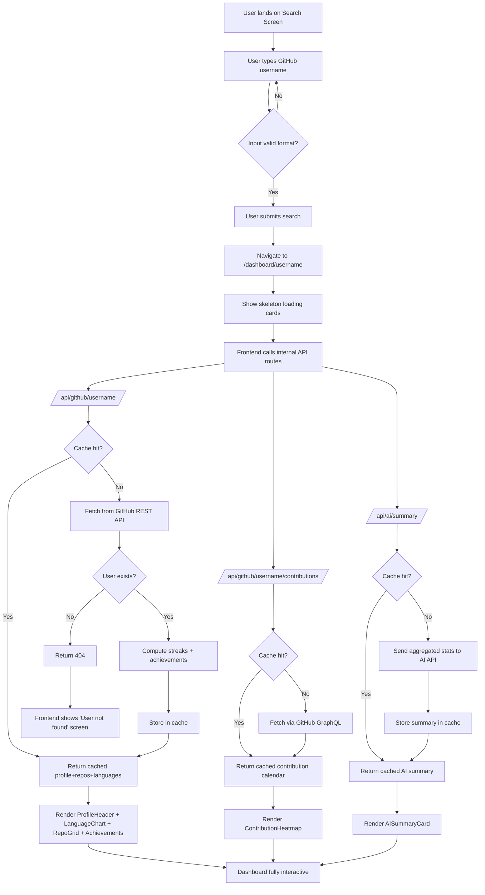
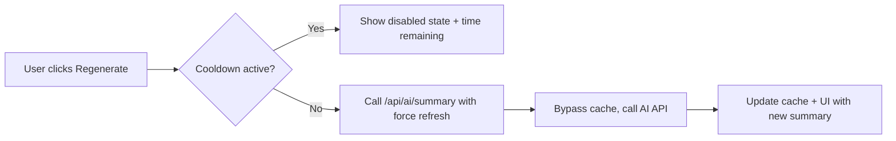

# App Flow Document
## GitHub Developer Dashboard

**Version:** 1.0
**Status:** Draft for Review

---

## 1. Primary User Flow

## 2. Step-by-Step Breakdown

### Step 1 — Landing
User arrives at the root URL. Sees the search screen (empty state, example usernames, recent searches from local storage if present).

### Step 2 — Search Submission
User types a username and hits enter/clicks "View Dashboard."
- Client-side validation: non-empty, valid GitHub username character set (alphanumeric + hyphens, no leading/trailing hyphen).
- On submit, router navigates to `/dashboard/[username]`, and the username is saved to the local "recent searches" list.

### Step 3 — Dashboard Load (Progressive)
The dashboard page mounts and independently kicks off three requests to internal API routes (not directly to GitHub):
1. `GET /api/github/[username]` — profile, repos, languages, computed streaks/achievements
2. `GET /api/github/[username]/contributions` — contribution calendar (GraphQL-backed)
3. `GET /api/ai/summary?username=...` — AI-generated summary (fires after #1 resolves, since it needs aggregated stats as input)

Each section of the UI renders a skeleton until its corresponding request resolves — sections do not block each other.

### Step 4 — Server-Side Handling (per request)
For each API route:
1. Check cache (Redis/DB) for a fresh entry keyed by username + resource.
2. **Cache hit:** return immediately.
3. **Cache miss:**
   - Call the relevant GitHub API (REST or GraphQL).
   - If the user doesn't exist → return 404 up to the client.
   - If data returned → compute any derived values (streaks, achievements, language percentages).
   - Write result to cache with appropriate TTL.
   - Return to client.

### Step 5 — AI Summary Generation (dependent step)
- Only triggered once profile/repo/language data is available (it needs that aggregate as input).
- Checks its own cache first (24h TTL).
- On miss, sends a structured JSON payload (no raw source code) to the LLM with a summarization prompt.
- Returns generated text; caches it.

### Step 6 — Rendering
As each response arrives, the corresponding component swaps from skeleton to populated:
- Profile header + language chart + repo grid + achievement badges (from step 1's response)
- Contribution heatmap (from step 2's response)
- AI summary card (from step 3's response, arrives last since it depends on step 1)

### Step 7 — Error Paths
- **Username not found:** Dashboard route immediately redirects/renders the "not found" state instead of partial skeletons.
- **One section fails, others succeed:** Only the failed card shows an inline error + retry button; rest of dashboard remains fully usable.
- **Rate limit hit:** If cached data exists (even stale), serve it with a "showing cached data" banner. If no cache exists, show a full rate-limit error with a suggested wait time.

### Step 8 — Repeat Search
User can search a new username via the sticky header search bar without leaving the dashboard shell — triggers the same flow starting at Step 3 for the new username.

### Step 9 — Regenerate AI Summary (secondary flow)
User clicks "Regenerate" on the AI summary card:

## 3. State Management Notes

- **URL is the source of truth** for which profile is being viewed (`/dashboard/[username]`) — enables shareable/bookmarkable links.
- Local component state (or React Query/SWR) handles per-section loading/error/data state independently, keyed by username, so switching between two recently viewed profiles can show cached client-side data instantly while revalidating in the background.
- "Recent searches" persisted in `localStorage` (client-only, not sensitive data).

---
*Next document: [Backend Schema](./05-Backend-Schema.md)*
