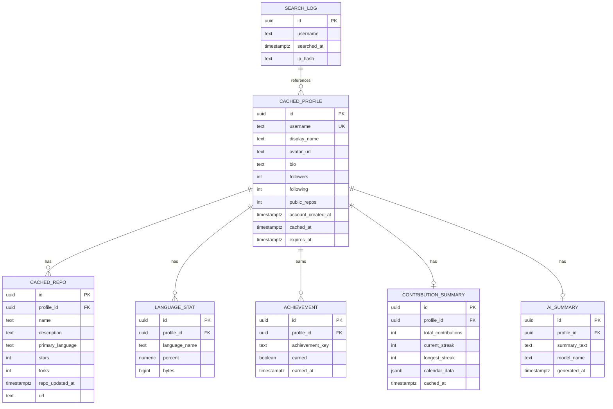

# Backend Schema Document
## GitHub Developer Dashboard

**Version:** 1.0
**Status:** Draft for Review

---

## 1. Overview

This app is mostly a **stateless proxy/aggregator** over the GitHub API — it doesn't need a full relational data model of "users" in the traditional app sense (no signup/login required for MVP). The backend's real job is:

1. Fetching + shaping GitHub data
2. **Caching** it (this is the main persistent data store)
3. Storing AI-generated summaries
4. Optionally logging searches (for a "trending/popular searches" feature)

Two implementation paths are outlined below — pick based on scope:

- **Path A (Recommended for MVP): Key-Value Cache Only (Redis)** — simplest, fastest to build, no schema migrations.
- **Path B (Extended): Relational DB (Postgres/Supabase)** — adds structure if you want search history, popular profiles, or future user accounts.

Both are documented so you can start with A and evolve into B if the project grows.

---

## 2. Path A — Redis Key-Value Cache (Recommended MVP)

### 2.1 Key Structure

| Key Pattern | Value (JSON) | TTL |
|---|---|---|
| `github:profile:{username}` | User profile + repo list + language aggregates + achievements | 1 hour |
| `github:contributions:{username}` | Contribution calendar (weeks/days) + streak calculations | 6 hours |
| `ai:summary:{username}` | AI-generated summary text + model + generated_at | 24 hours |
| `meta:ratelimit:github` | Current GitHub rate limit remaining/reset (for internal throttling) | 1 minute |

### 2.2 Example Cached Value — `github:profile:{username}`

```json
{
  "username": "octocat",
  "name": "The Octocat",
  "avatarUrl": "https://avatars.githubusercontent.com/u/583231",
  "bio": "GitHub mascot",
  "followers": 12000,
  "following": 9,
  "publicRepos": 8,
  "accountCreatedAt": "2011-01-25T18:44:36Z",
  "topRepos": [
    {
      "name": "Hello-World",
      "description": "My first repository on GitHub!",
      "language": "N/A",
      "stars": 2800,
      "forks": 2200,
      "updatedAt": "2024-03-10T12:00:00Z",
      "url": "https://github.com/octocat/Hello-World"
    }
  ],
  "languages": [
    { "name": "JavaScript", "percent": 42.5, "bytes": 128500 },
    { "name": "Python", "percent": 31.2, "bytes": 94300 },
    { "name": "TypeScript", "percent": 18.1, "bytes": 54700 }
  ],
  "achievements": [
    { "id": "century_club", "earned": true, "label": "100+ contributions this year" },
    { "id": "polyglot", "earned": true, "label": "5+ languages used" },
    { "id": "star_collector", "earned": false, "label": "100+ total stars" }
  ],
  "cachedAt": "2026-07-26T10:15:00Z"
}
```

### 2.3 Example Cached Value — `github:contributions:{username}`

```json
{
  "username": "octocat",
  "totalContributions": 842,
  "currentStreak": 6,
  "longestStreak": 34,
  "calendar": [
    { "date": "2025-07-27", "count": 3 },
    { "date": "2025-07-28", "count": 0 }
  ],
  "cachedAt": "2026-07-26T10:15:00Z"
}
```

### 2.4 Example Cached Value — `ai:summary:{username}`

```json
{
  "username": "octocat",
  "summary": "This developer shows consistent activity...",
  "model": "claude-sonnet-4-6",
  "generatedAt": "2026-07-26T10:16:00Z"
}
```

---

## 3. Path B — Relational Schema (Extended / Future)

If you later add accounts, saved profiles, or analytics, here's a normalized schema (Postgres syntax).



### 3.1 Table Definitions (SQL)

```sql
CREATE TABLE cached_profile (
    id UUID PRIMARY KEY DEFAULT gen_random_uuid(),
    username TEXT UNIQUE NOT NULL,
    display_name TEXT,
    avatar_url TEXT,
    bio TEXT,
    followers INT DEFAULT 0,
    following INT DEFAULT 0,
    public_repos INT DEFAULT 0,
    account_created_at TIMESTAMPTZ,
    cached_at TIMESTAMPTZ DEFAULT now(),
    expires_at TIMESTAMPTZ NOT NULL
);

CREATE TABLE cached_repo (
    id UUID PRIMARY KEY DEFAULT gen_random_uuid(),
    profile_id UUID REFERENCES cached_profile(id) ON DELETE CASCADE,
    name TEXT NOT NULL,
    description TEXT,
    primary_language TEXT,
    stars INT DEFAULT 0,
    forks INT DEFAULT 0,
    repo_updated_at TIMESTAMPTZ,
    url TEXT
);

CREATE TABLE language_stat (
    id UUID PRIMARY KEY DEFAULT gen_random_uuid(),
    profile_id UUID REFERENCES cached_profile(id) ON DELETE CASCADE,
    language_name TEXT NOT NULL,
    percent NUMERIC(5,2),
    bytes BIGINT
);

CREATE TABLE achievement (
    id UUID PRIMARY KEY DEFAULT gen_random_uuid(),
    profile_id UUID REFERENCES cached_profile(id) ON DELETE CASCADE,
    achievement_key TEXT NOT NULL,
    earned BOOLEAN DEFAULT false,
    earned_at TIMESTAMPTZ
);

CREATE TABLE contribution_summary (
    id UUID PRIMARY KEY DEFAULT gen_random_uuid(),
    profile_id UUID REFERENCES cached_profile(id) ON DELETE CASCADE,
    total_contributions INT DEFAULT 0,
    current_streak INT DEFAULT 0,
    longest_streak INT DEFAULT 0,
    calendar_data JSONB,
    cached_at TIMESTAMPTZ DEFAULT now()
);

CREATE TABLE ai_summary (
    id UUID PRIMARY KEY DEFAULT gen_random_uuid(),
    profile_id UUID REFERENCES cached_profile(id) ON DELETE CASCADE,
    summary_text TEXT NOT NULL,
    model_name TEXT,
    generated_at TIMESTAMPTZ DEFAULT now()
);

CREATE TABLE search_log (
    id UUID PRIMARY KEY DEFAULT gen_random_uuid(),
    username TEXT NOT NULL,
    searched_at TIMESTAMPTZ DEFAULT now(),
    ip_hash TEXT
);

CREATE INDEX idx_search_log_username ON search_log(username);
CREATE INDEX idx_cached_profile_expires ON cached_profile(expires_at);
```

### 3.2 Notes on Path B
- `expires_at` per profile row drives TTL-style invalidation without needing Redis.
- `search_log` (with a hashed IP, not raw IP, for privacy) enables a future "trending profiles searched today" feature.
- If you add real user accounts later (e.g., "save your dashboard"), add a `USERS` table with `auth_provider`, `github_username`, and a join table for saved/favorited profiles.

---

## 4. API Contract Summary (Internal Endpoints)

| Method | Route | Returns |
|---|---|---|
| GET | `/api/github/{username}` | Profile, repos, languages, achievements |
| GET | `/api/github/{username}/contributions` | Contribution calendar, streaks |
| GET | `/api/ai/summary?username={username}` | AI-generated summary (cached) |
| POST | `/api/ai/summary/regenerate` | Force-refresh AI summary, bypassing cache |
| GET | `/api/health` | Service + cache connectivity check |

All routes return standard error shape on failure:
```json
{ "error": { "code": "USER_NOT_FOUND", "message": "No GitHub user found for 'xyz'." } }
```

---

## 5. Data Retention & Privacy

- No personally identifying data is stored beyond what's already public on GitHub.
- If `search_log` is implemented, IPs are hashed, never stored raw, and log entries can be purged on a rolling 30-day basis.
- No GitHub OAuth tokens are stored per-user in MVP (server uses its own token); if OAuth login is added later, tokens must be encrypted at rest.

---

*End of document set. Five documents total: PRD → TRD → UI/UX Design → App Flow → Backend Schema.*
